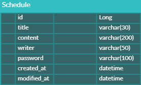

## API 명세

### 1. 일정 생성

| 항목           | 내용                                                              |
|----------------|-----------------------------------------------------------------|
| **URL**        | `POST /schedules`                                               |
| **Request Body** | - `title`    - `content`   - `writer`   - `password`  |
| **Response Body** | - `id`   - `title`   - `content`   - `writer`   - `createdAt`   - `modifiedAt` |

### 2. 전체 일정 조회

| 항목            | 내용                            |
|-----------------|---------------------------------|
| URL             | GET /schedules                  |
| Request Params  | (선택) `writer` (작성자명)     |
| Response Body   | - `id`   - `title`   - `content`   - `writer`   - `createdAt`   - `modifiedAt` |

### 3. 선택 일정 조회

| 항목            | 내용              |
|-----------------|-------------------|
| URL             | GET /schedules/{id} |
| Path Variable   | `id`          |
| Response Body   | - `id`   - `title`   - `content`   - `writer`   - `createdAt`   - `modifiedAt` |

### 4. 일정 수정

| 항목            | 내용                          |
|-----------------|-------------------------------|
| URL             | PUT /schedules/{id}           |
| Request Body    | - `title`   - `writer`   - `password` |
| Response Body   | - `id`   - `title`   - `content`   - `writer`   - `createdAt`   - `modifiedAt` |
| Error           | 403 Forbidden - 비밀번호 불일치 |

### 5. 일정 삭제

| 항목            | 내용                          |
|-----------------|-------------------------------|
| URL             | DELETE /schedules/{id}        |
| Request Body    | - `password`                    |
| Error           | 403 Forbidden - 비밀번호 불일치 |

